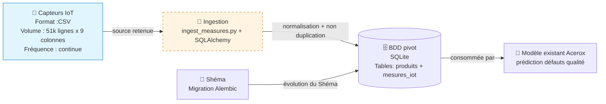

# M3-B2 (pipeline + migration Acerox)

> **Binôme**: Joelle et Célia Le binôme désigné par la formatrice à 9h

---

## 🚀 Démarrage 

```bash
# 0. Clone votre repo binôme
git clone git@github.com/Celia-34/ia-atos-parcours-m3-b2-joelle-celia.git
cd ia-atos-parcours-m3-b2-joelle-celia

# 1. Environnement virtuel
python -m venv .venv && source .venv/bin/activate

# 2. Dépendances
pip install -r requirements.txt

# 3. Init BDD (pipeline existante)
## pour savoir où se situe la head (sur quelle version)
alembic current -v
## pour mettre à jour la head sur la dernière version
alembic upgrade head

# 3. Faire tourner la pipeline
python -m src.pipeline_existante

# 4. Vérification des tests 
pytest -v
```
---
## Mise à jour du schéma de la DB

### Ajout d'une mise à jour du schéma de la DB
Il peut etre nécessaire de faire des modification du schéma de la DB, mais tout changement doit etre versionné.
Grâce à Alembic, à partir d'un modèle de donnée, il est possible de générer automatiquement le script de modification du schéma de la DB versionné.
```bash
# pour créer une nouvelle version 
alembic revision --autogenerate -m "add <table> table"
```

### Rollback d'une mise à jour du schéma de la DB
Il peut être nécessaire de procéder à un rollback d'un script alembic de mise à jour de la base de données, aussi appelée 'version', lorsqu'une modification de la base de données n'est plus souhaitée (déploiement annulé, retrait d'un ticket) ou si celui-ci comporte des bugs. Cela peut aussi etre nécessaire en phase de maintenance lors de l'investigation pour éliminer des cause possible au problème rencontré.
```bash
## pour rollback une version (-1 rollback la dernière version, la head est placée à l'avant dernière version)
alembic downgrade -1
```
---


## Schéma



## 📁 Structure du repo

```
M3-B2-acerox-<binome>/
├── data/
│   ├── produits.csv                  # référentiel initial (committé)
│   ├── capteurs_iot.csv              # fourni mercredi (gitignored)
│   ├── erp_export.json               # fourni mercredi (gitignored)
│   └── acerox.db                     # BDD locale (gitignored)
├── src/
│   ├── __init__.py
│   ├── db.py                         # engine + session SQLAlchemy
│   ├── models.py                     # Produit + TODO votre table
│   ├── pipeline_existante.py         # ne pas modifier
│   └── ingest_mesures.py            # à créer (votre code)
├── alembic/
│   ├── env.py
│   ├── script.py.mako
│   └── versions/
│       ├── 0001_initial_schema.py    # table produits
│       └── d245190e3547_add_measures_table.py  # table mesures_iot
├── tests/
│   ├── __init__.py
│   ├── conftest.py                   # fixtures BDD éphémère
│   ├── test_pipeline_initial.py      # DOIT rester vert
│   ├── test_ingest.py                # à créer
│   └── test_migration.py             # à créer
├── ressources/                       # 📚 5 mini-cours d'appui
│   ├── README.md
│   ├── 01_SQLAlchemy_ORM_essentiel.md
│   ├── 02_Alembic_migration_essentiel.md
│   ├── 03_Ingestion_idempotente_essentiel.md
│   ├── 04_Tests_pipeline_essentiel.md
│   ├── 05_Pair_coding_git_essentiel.md
│   └── liens_officiels.md
├── decisions.md                      # template binôme — vos choix tracés
├── alembic.ini
├── requirements.txt
├── .gitignore
└── README.md (ce fichier — à compléter avec schéma Mermaid + démarrage)
```

---

## 📚 Mini-cours d'appui

Cf. [`./ressources/`](./ressources/) — 5 mini-cours, lecture juste-à-temps.

| Tâche | Mini-cours |
|---|---|
| Modèles SQLAlchemy | [`01_SQLAlchemy_ORM_essentiel.md`](./ressources/01_SQLAlchemy_ORM_essentiel.md) |
| Migration Alembic | [`02_Alembic_migration_essentiel.md`](./ressources/02_Alembic_migration_essentiel.md) |
| Ingestion idempotente | [`03_Ingestion_idempotente_essentiel.md`](./ressources/03_Ingestion_idempotente_essentiel.md) |
| Tests pipeline | [`04_Tests_pipeline_essentiel.md`](./ressources/04_Tests_pipeline_essentiel.md) |
| Pair-coding Git binôme | [`05_Pair_coding_git_essentiel.md`](./ressources/05_Pair_coding_git_essentiel.md) |

### 📄 Documents fournis par Acerox (lecture seule, avant de coder)

| Document | Rôle |
|---|---|
| [`fiche_modele_acerox.md`](./ressources/fiche_modele_acerox.md) | À *qui* vous livrez : le modèle de prédiction NC déjà en production |
| [`contrat_donnees_modele.md`](./ressources/contrat_donnees_modele.md) | La **table cible** + clauses de qualité que votre pipeline doit honorer |

---

## 🧭 Démarche attendue

### Mercredi sync (2 h)

1. **Setup binôme + appropriation squelette** (30 min)
2. **Choix de la source** dans `decisions.md` — *et pourquoi pas l'autre* ;
   réflexe stockage appuyé sur la **grille « Stockage & échelle »**
   (cf. [`ressources/liens_officiels.md`](./ressources/liens_officiels.md)) (15 min)
3. **Normalisation + ingestion** premier jet (45 min)
4. **Tour de table** 11h30 — démo + discussion versionning (30 min)

### Async jeudi/vendredi matin (3 h binôme)

5. **Migration Alembic** (1 h)
6. **Tests pytest** (45 min)
7. **README + Mermaid + tag v0.1.0-pipeline-m3** (1 h)
8. **Finition + RDV vendredi** (15 min)

→ Compétences visées : **C1 — imiter** renforcé + **C3 — transposer** (palier final).

---

## ✅ Conventions de code

- Python 3.11+
- Type hints sur signatures publiques
- Pas de `print` (utiliser `logging` si besoin)
- `pathlib.Path` pour les chemins
- Tous les commits binôme : `Co-authored-by: <prénom> <email>`

---

## 🆘 Bloqué·e·s ?

1. Relisez le mini-cours de votre tâche actuelle.
2. **Si Alembic bug** : `alembic upgrade head` doit toujours marcher. Si
   non, supprime `data/acerox.db` et relance — la BDD se reconstruit.
3. **Si pytest casse** : commencez par vérifier que `test_pipeline_initial.py`
   reste vert. Si oui, votre régression est localisée — relisez vos diff.
4. Demandez sur Discord (`fil-M3-B2`). 30 min sur un bloquant = MP voix.
